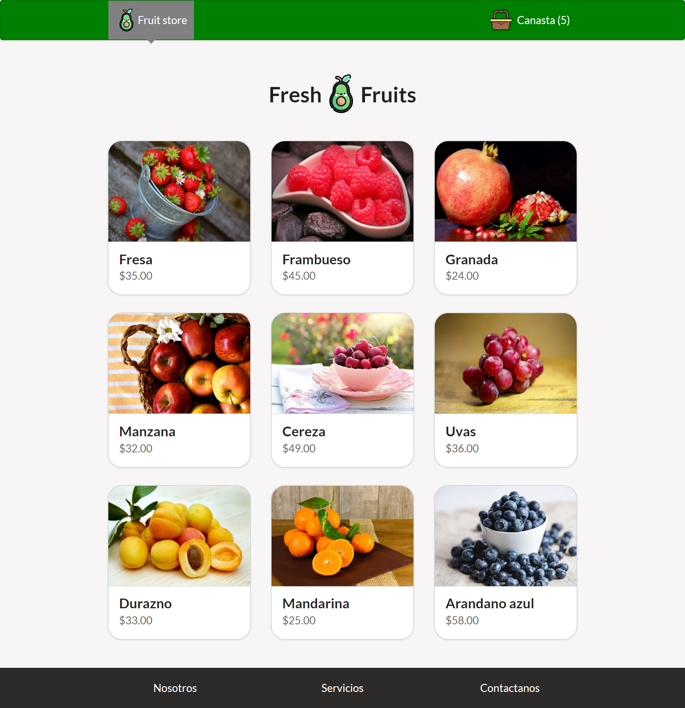

# Next JS

Instalar las dependencias del proyecto:
- npm install

Para compilar el proyecto en un entorno de desarrollo:
- npm run dev

Para ejecutar el proyecto en un entorno de producción:
- npm run build
- npm run start

